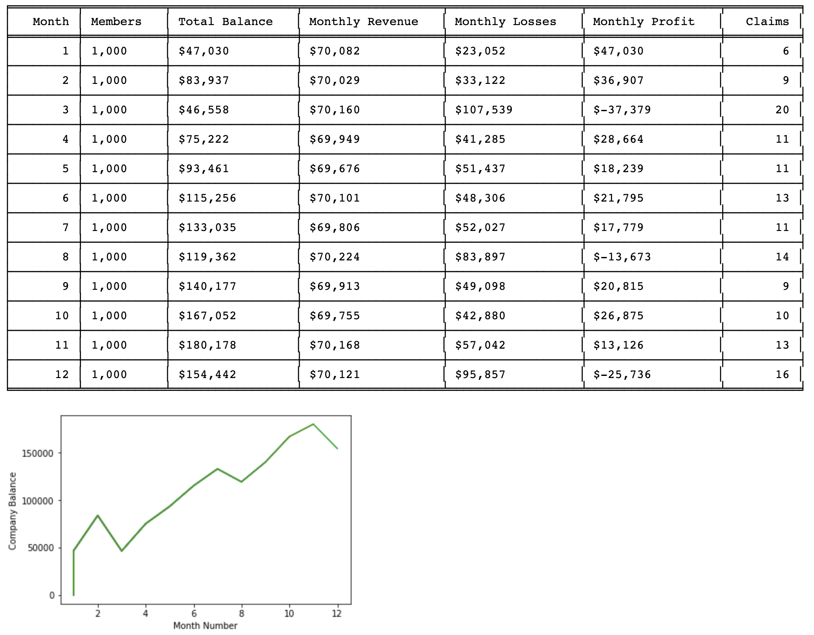

# insurance-monte-carlo

### Car Insurance Profit/Loss, a Monte Carlo Simulation
A financial modelling project.

By Rory GS

### About

This python 3 project generates the expected profit/loss for a car insurance company over a given period of time. It allows you to model using several variables. Their names, explanations and initial values are detailed below. Both a .py script and an identical .ipynb python notebook are included. The claim amounts and probabilities are drawn from recent insurance statistics in both the US and Aus markets. The outputs in this model are in AUD but can easily be converted to USD.

### Parameters

| name | explanation | initial value |
| ------ | ------ | ------ |
| balance | Initial funds | 0  |
| memberCount | Starting member count | 1000  |
| memberGrowthRate | Monthly member count growth rate | 1.01  |
| monthsToModel | How many months should the model run | 24  |
| annualInjuryRate | Percentage of customers making personal injury claims | 1.10  |
| annualPropertyDamageRate | Percentage of customers making property damage claims | 4.0  |
| annualCollisionRate | Percentage of customers making collision damage claims | 6.15  |
| annualComprehensiveRate | Percentage of customers making comprehensive damage claims | 2.85  |

### Result

The model outputs a series of charts and graphs created using matplotlib and the tabulate module. It details the monthly revenue, losses and claims.

An example run outputs as follows:

### Example Output

Starting with funds of: 0 

Starting member count of: 1000 

Running for a total of: 12 months
_________
Month 1 ending funds total $47,030 with Revenue of $70,082 and losses of: $23,052 from 6 claims

Month 2 ending funds total $83,937 with Revenue of $70,029 and losses of: $33,122 from 9 claims

Month 3 ending funds total $46,558 with Revenue of $70,160 and losses of: $107,539 from 20 claims

Month 4 ending funds total $75,222 with Revenue of $69,949 and losses of: $41,285 from 11 claims

Month 5 ending funds total $93,461 with Revenue of $69,676 and losses of: $51,437 from 11 claims

Month 6 ending funds total $115,256 with Revenue of $70,101 and losses of: $48,306 from 13 claims

Month 7 ending funds total $133,035 with Revenue of $69,806 and losses of: $52,027 from 11 claims

Month 8 ending funds total $119,362 with Revenue of $70,224 and losses of: $83,897 from 14 claims

Month 9 ending funds total $140,177 with Revenue of $69,913 and losses of: $49,098 from 9 claims

Month 10 ending funds total $167,052 with Revenue of $69,755 and losses of: $42,880 from 10 claims

Month 11 ending funds total $180,178 with Revenue of $70,168 and losses of: $57,042 from 13 claims

Month 12 ending funds total $154,442 with Revenue of $70,121 and losses of: $95,857 from 16 claims

### License

MIT

### Contact

You are welcome to contact me via:

<a href="https://www.linkedin.com/in/rory-garton-smith-5b991659/" target="_blank">`Linkedin`</a>

or email: rorygartonsmith@gmail.com
